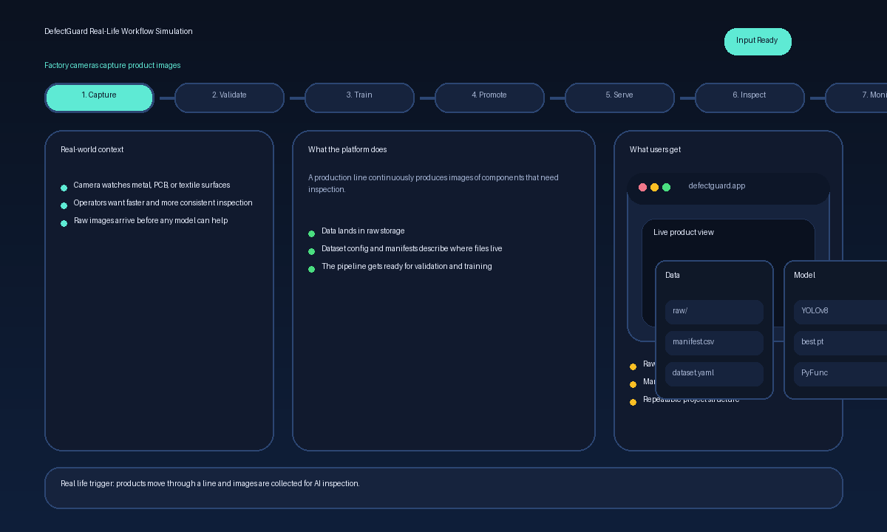

# DefectGuard 

DefectGuard is a computer vision MLOps system for automated manufacturing defect detection.

It combines model training, experiment tracking, model packaging, API serving, browser-based inspection, monitoring, orchestration, and local deployment into one end-to-end system.


## Platform Simulation

 capture -> validate -> train -> promote -> serve -> inspect -> monitor.



## Summary

- Uses YOLOv8 for visual defect detection on manufacturing-style image data
- Tracks experiments, artifacts, and model versions with MLflow
- Validates input data before training with Great Expectations
- Serves predictions through a FastAPI inference API and lightweight frontend
- Logs predictions for monitoring and drift analysis
- Generates drift reports with Evidently
- Orchestrates workflows with Prefect
- Reproduces pipeline stages with DVC
- Ships with Docker Compose, Nginx, Prometheus, and Grafana for local platform operations
- Includes automated tests and GitHub Actions CI


## Architecture

the platform is organized into five layers:

- Data layer: dataset download, manifest validation, dataset config, DVC stages
- Training layer: YOLOv8 training, MLflow tracking, evaluation, registry packaging
- Serving layer: FastAPI API, prediction abstraction, browser frontend
- Monitoring layer: JSONL prediction logs, Evidently drift reports, Prometheus metrics, Grafana dashboards
- Operations layer: Prefect flows, Docker images, Docker Compose stack, Nginx reverse proxy, CI

## Core Capabilities

### Training And Registry

- YOLOv8 training via `scripts/train.py`
- MLflow experiment logging for params, metrics, and artifacts
- MLflow PyFunc packaging for standardized model serving
- Optional registry promotion using model version tags
- Quality gate based on `mAP@0.5`
- Champion-vs-challenger promotion logic for Production stage decisions

### Monitoring And Reliability

- Prediction log capture in JSONL format
- Reference-vs-current drift reporting with Evidently
- Prometheus service metrics
- Grafana datasource provisioning
- Local restart policies and healthchecks in Docker Compose
- Automated API tests with lightweight dummy predictor mode

## Technology Stack

### ML And Data

- YOLOv8 / Ultralytics
- NumPy
- Pandas
- Pillow
- Great Expectations
- DVC

### MLOps And Model Lifecycle

- MLflow Tracking
- MLflow PyFunc
- MLflow Model Registry
- Prefect
- Evidently

### Serving And Platform

- FastAPI
- Uvicorn
- Nginx
- Docker
- Docker Compose

### Monitoring And Quality

- Prometheus
- Grafana
- pytest
- Ruff
- GitHub Actions


## Getting Started

### Prerequisites

- Python 3.11
- `pip`
- Docker and Docker Compose for containerized local runs

### Install Dependencies

```bash
pip3 install -r requirements.txt -r requirements-mlops.txt -r requirements-dev.txt
```

## Quickstart: Local API Run

Set the project import path and point the API to a local YOLO weights file:

```bash
export PYTHONPATH=src
export MODEL_PATH=/absolute/path/to/best.pt
uvicorn api.main:app --reload
```

Open:

- UI: `http://127.0.0.1:8000/`
- Swagger docs: `http://127.0.0.1:8000/docs`


## Quickstart: Full Local Platform

Start the full stack:

```bash
docker compose up --build
```

Service endpoints:

- Nginx entrypoint and UI: `http://127.0.0.1:8080`
- API direct access: `http://127.0.0.1:8000`
- MLflow UI: `http://127.0.0.1:5000`
- Prometheus UI: `http://127.0.0.1:9090`
- Grafana UI: `http://127.0.0.1:3000` using `admin/admin`

## Dataset Setup

Download and extract the dataset:

```bash
python3 scripts/download_mvtec_ad.py --out data/raw/mvtec_ad
```

Important note:

- MVTec AD is released under `CC BY-NC-SA 4.0`
- review license terms before any non-demo use

## Training

Training expects a YOLO dataset YAML. A placeholder example is available at `data/dataset.yaml`.

Run training with MLflow tracking:

```bash
export MLFLOW_TRACKING_URI=http://127.0.0.1:5000
export MLFLOW_EXPERIMENT_NAME=defect-detection
export MLFLOW_MODEL_NAME=defect-yolo
PYTHONPATH=src python3 scripts/train.py --data data/dataset.yaml
```

Enable a production-style quality gate:

```bash
export MLFLOW_TRACKING_URI=http://127.0.0.1:5000
export MLFLOW_MODEL_NAME=defect-yolo
export ENFORCE_GATE=1
export MIN_MAP50=0.85
export PROMOTE_MODEL=1
PYTHONPATH=src python3 scripts/train.py --data data/dataset.yaml
```

## Data Validation

Validate the training manifest before model training:

```bash
PYTHONPATH=src python3 scripts/validate_data.py --manifest data/manifest.csv
```

What this checks:

- required manifest schema
- null safety for image paths
- file existence on disk
- optional label file presence

## DVC Pipeline

The repository defines a simple reproducible DVC pipeline in `dvc.yaml`.

Current stages:

- `download_mvtec_ad`
- `validate`
- `train`

Run the pipeline:

```bash
dvc repro
```

## Monitoring And Drift

Runtime and model monitoring are both included.

### Service Monitoring

- Prometheus scrapes `/metrics`
- Grafana reads from Prometheus
- FastAPI exposes request count and latency metrics

### Behavior Monitoring

- the API logs predictions to `data/predictions.jsonl`
- `scripts/set_reference_predictions.py` creates a baseline snapshot
- `scripts/drift_report.py` compares baseline vs current behavior

Generate a drift report:

```bash
python3 scripts/set_reference_predictions.py
python3 scripts/drift_report.py
```

## Workflow Orchestration

Prefect flows are provided for:

- retraining flow: validation -> training
- monitoring flow: reference snapshot -> drift report

Run the default flow entrypoint:

```bash
python3 pipelines/prefect_flow.py
```

### Training And Gating

- `MLFLOW_EXPERIMENT_NAME`
- `MIN_MAP50`
- `ENFORCE_GATE`
- `PROMOTE_MODEL`

### Dataset Helper

- `MVTEC_AD_URL`
- `MVTEC_AD_ARCHIVE`
- `MVTEC_AD_OUT`


## Current Outputs

During normal usage, the platform creates outputs such as:

- `runs/` from YOLO training
- `data/predictions.jsonl`
- `data/reference_predictions.jsonl`
- `reports/validation.ok`
- `reports/drift_report.html`
- MLflow run and model artifacts

## Limitations And Next Steps

This is a strong production-shaped portfolio project, but a real industrial rollout may also require:

- persistent external databases and object storage
- role-based access control
- secret management
- alerting policies
- larger-scale dataset pipelines
- label-aware production monitoring
- GPU scheduling and infrastructure tuning
- Kubernetes or infrastructure-as-code deployment layers

## Usage Notes

If you use the MVTec AD helper flow, make sure dataset usage follows the original dataset license.
